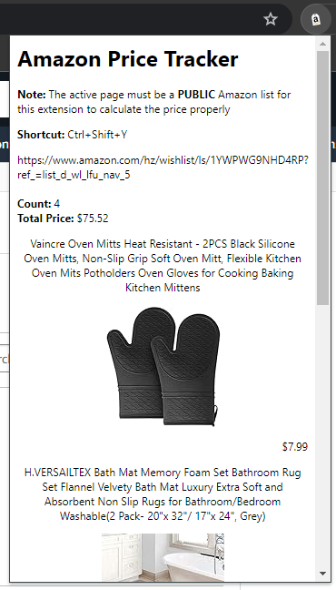

# amazon-price-calculator
<!-- TABLE OF CONTENTS -->
<details open="open">
  <summary><h2 style="display: inline-block">Table of Contents</h2></summary>
  <ol>
    <li>
      <a href="#about-the-project">About The Project</a>
      <ul>
        <li><a href="#built-with">Built With</a></li>
      </ul>
    </li>
    <li><a href="#contact">Contact</a></li>
  </ol>
</details>

<!-- ABOUT THE PROJECT -->
## About The Project

* A Chrome extension to calculate total price and item count in Amazon shopping lists



### Built With

* JavaScript
* HTML
* CSS
* Express JS

<p align="right">(<a href="#amazon-price-calculator">back to top</a>)</p>

### Amazon Price Calculator

Open Google Chrome Extension by clicking on the icon or using the Shortcut (Windows: CTRL + SHIFT + Y; Mac: CMD + SHIFT + Y)<br>
Note: Express.js server must be running for the Google Chrome Extension to work

[Video Tutorial](https://github.com/meganle414/amazon-price-calculator/assets/66089268/427ab79b-6734-48cc-af98-a94fbd16289a)<br>


Express.js server is run using
```node calculate.js```
which returns a JSON response to the extension with the total item count and total price of all the items in the list

<p align="right">(<a href="#amazon-price-calculator">back to top</a>)</p>

<!-- CONTACT -->
## Contact

Email: meganle414@gmail.com

Project Link: [https://github.com/meganle414/amazon-price-calculator](https://github.com/meganle414/amazon-price-calculator)

[linkedin-url]: https://linkedin.com/in/meganle414/

<p align="right">(<a href="#amazon-price-calculator">back to top</a>)</p>